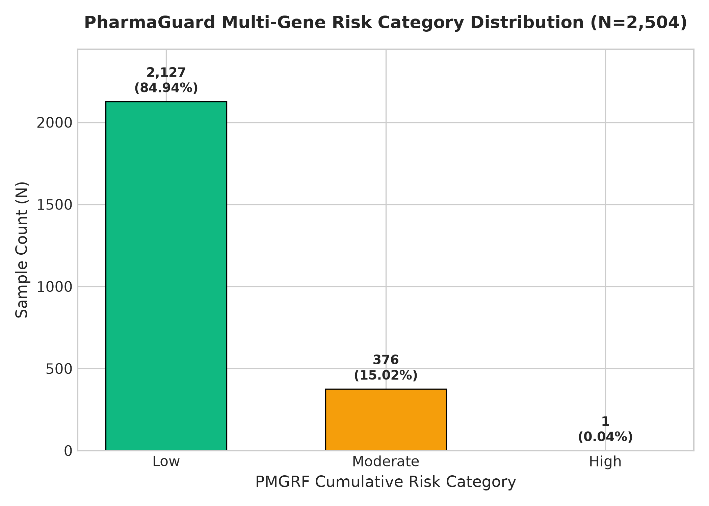
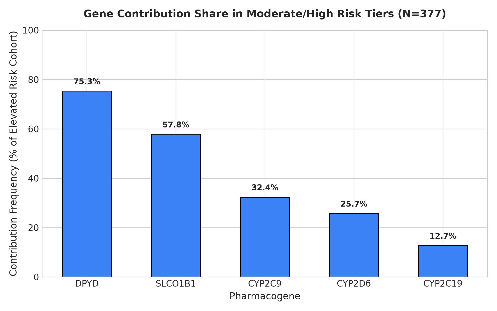
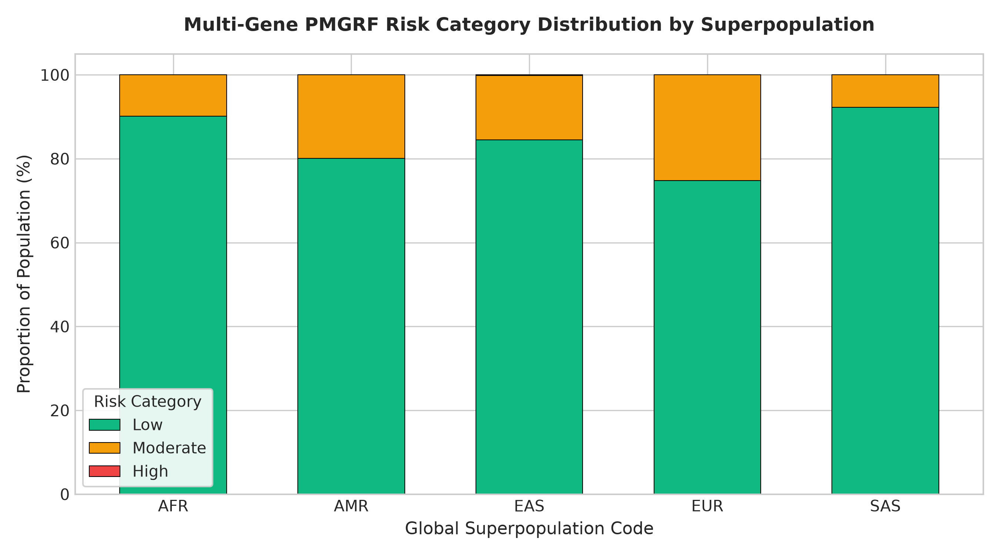
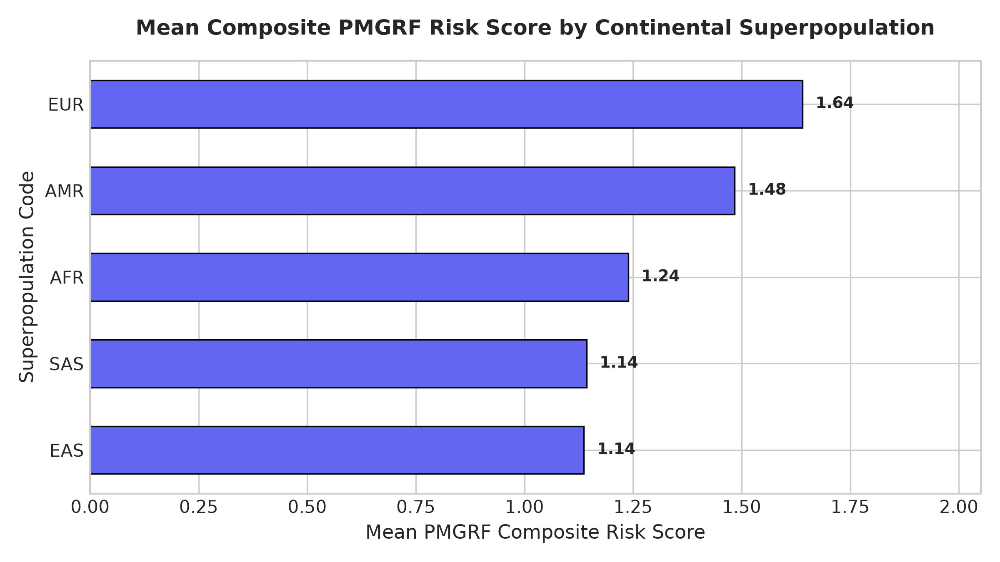
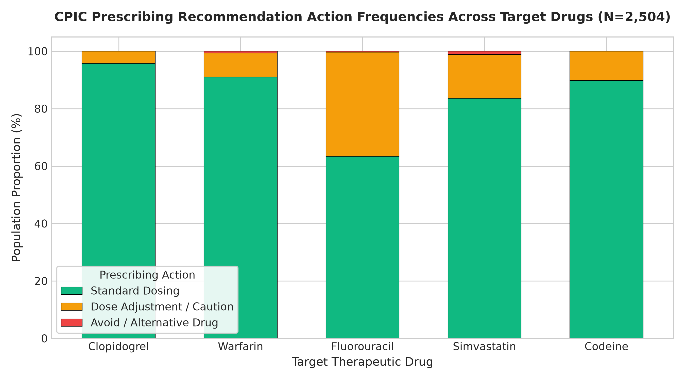

# PMGRF Population Visualization & Clinical Results Report
**Dataset**: 1000 Genomes Phase 3 Cohort (2,504 Samples)  
**Output Directory**: `research/figures/`  
**Target Audience**: Pharmacogenomics & Precision Medicine Conference Proceedings  

## Executive Summary
This report summarizes population-scale pharmacogenomic risk patterns and prescribing recommendation distributions across 2,504 multi-ethnic individuals using high-resolution publication-quality figures.

## Figure Index & Analytical Findings
### Figure 1: Risk Category Distribution Chart

- **Low Risk (0–2 points)**: **84.94%** (2,127 samples)
- **Moderate Risk (3–5 points)**: **15.02%** (376 samples)
- **High Risk (6+ points)**: **0.04%** (1 samples)

### Figure 2: Gene Contribution Share in Elevated Risk Tiers

- **Top Driver**: `DPYD` variant presence is responsible for elevating **75.27%** of Moderate/High risk individuals.
- **Secondary Driver**: `SLCO1B1` decreased function contributes to **57.71%** of elevated risk individuals.

### Figure 3: Superpopulation Risk Category Comparison

- **Highest Risk Cohort**: European (`EUR`) population exhibits **25.2%** Moderate Risk rate.
- **Lowest Risk Cohort**: South Asian (`SAS`) population exhibits **7.8%** Moderate Risk rate.

### Figure 4: Mean PMGRF Composite Risk Score by Population

- **`EAS`**: Mean Score = **1.14**
- **`SAS`**: Mean Score = **1.14**
- **`AFR`**: Mean Score = **1.24**
- **`AMR`**: Mean Score = **1.48**
- **`EUR`**: Mean Score = **1.64**

### Figure 5: Drug Recommendation Prescribing Action Frequencies

Summary of action requirements per target drug:
- **Clopidogrel**: Standard (95.8%), Dose Adjustment (4.2%), Avoid (0.0%)
- **Warfarin**: Standard (91.0%), Dose Adjustment (8.5%), Avoid (0.6%)
- **Fluorouracil**: Standard (63.4%), Dose Adjustment (36.3%), Avoid (0.3%)
- **Simvastatin**: Standard (83.6%), Dose Adjustment (15.2%), Avoid (1.2%)
- **Codeine**: Standard (89.8%), Dose Adjustment (10.2%), Avoid (0.0%)